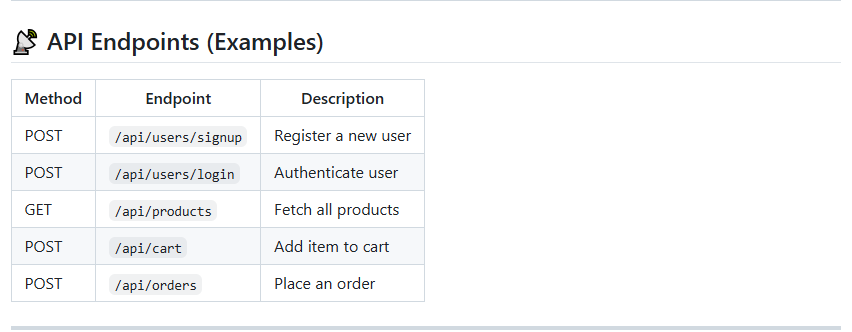

---

# 🛒 Online Shop Back-End

A Java-based back-end service for an online shopping application. This project provides the foundational server-side logic, APIs, and database integration required to power an e-commerce platform.

---

## 📌 Features
- User management (registration, login, authentication)
- Product catalog management (CRUD operations)
- Shopping cart functionality
- Order processing
- RESTful API endpoints
- Maven-based project structure for easy dependency management

---

## 🛠️ Tech Stack
- **Language:** Java  
- **Framework:** Spring Boot  
- **Build Tool:** Maven  
- **Database:** (configure in `application.properties`, e.g., MySQL/PostgreSQL)  
- **Version Control:** GitHub  

---

## 📂 Project Structure
```
Online-shop-back-end/
│── .mvn/              # Maven wrapper files
│── images/            # Project-related images
│── src/               # Source code (controllers, services, models)
│── .gitattributes     # Git attributes configuration
│── .gitignore         # Git ignore rules
│── mvnw               # Maven wrapper script (Linux/Mac)
│── mvnw.cmd           # Maven wrapper script (Windows)
│── pom.xml            # Maven project configuration
```

---

## 🚀 Getting Started

### Prerequisites
- Java 17+  
- Maven 3.8+  
- A running database instance (configure in `application.properties`)  

### Installation
1. Clone the repository:
   ```bash
   git clone https://github.com/erickomondi760/Online-shop-back-end.git
   cd Online-shop-back-end
   ```
2. Build the project:
   ```bash
   mvn clean install
   ```
3. Run the application:
   ```bash
   mvn spring-boot:run
   ```

---

## 📡 API Endpoints (Examples)
| Method | Endpoint            | Description              |
|--------|---------------------|--------------------------|
| POST   | `/api/users/signup` | Register a new user      |
| POST   | `/api/users/login`  | Authenticate user        |
| GET    | `/api/products`     | Fetch all products       |
| POST   | `/api/cart`         | Add item to cart         |
| POST   | `/api/orders`       | Place an order           |

---

## 🧪 Testing
Run unit and integration tests with:
```bash
mvn test
```

---

## 📸 Screenshots


---

## ☁️ Deployment

### Option 1: Docker
1. Create a `Dockerfile` in the project root:
   ```dockerfile
   FROM openjdk:17-jdk-slim
   WORKDIR /app
   COPY target/online-shop-backend.jar app.jar
   ENTRYPOINT ["java","-jar","app.jar"]
   ```
2. Build and run the container:
   ```bash
   docker build -t online-shop-backend .
   docker run -p 8080:8080 online-shop-backend
   ```

### Option 2: Cloud Hosting (Heroku/AWS/GCP/Azure)
- Package the app:
  ```bash
  mvn clean package
  ```
- Deploy the generated `.jar` file to your chosen cloud provider.
- Configure environment variables (e.g., database credentials) in the cloud service dashboard.

### Option 3: Local Server
- Run the `.jar` file directly:
  ```bash
  java -jar target/online-shop-backend.jar
  ```

---

## 🔄 CI/CD Setup (GitHub Actions)

Automate builds, tests, and deployments using GitHub Actions.

1. Create a workflow file at `.github/workflows/maven.yml`:
   ```yaml
   name: Java CI with Maven

   on:
     push:
       branches: [ "main" ]
     pull_request:
       branches: [ "main" ]

   jobs:
     build:
       runs-on: ubuntu-latest

       steps:
       - name: Checkout code
         uses: actions/checkout@v3

       - name: Set up JDK 17
         uses: actions/setup-java@v3
         with:
           java-version: '17'
           distribution: 'temurin'

       - name: Build with Maven
         run: mvn clean install

       - name: Run tests
         run: mvn test
   ```

2. (Optional) Add deployment steps:
   - Push Docker images to **Docker Hub** or **GitHub Container Registry**.
   - Deploy to **Heroku**, **AWS Elastic Beanstalk**, or **Azure App Service**.

---

## 🤝 Contributing
Contributions are welcome!  
1. Fork the repo  
2. Create a new branch (`feature-xyz`)  
3. Commit changes  
4. Open a Pull Request  

---

## 📜 License
This project is licensed under the MIT License.

